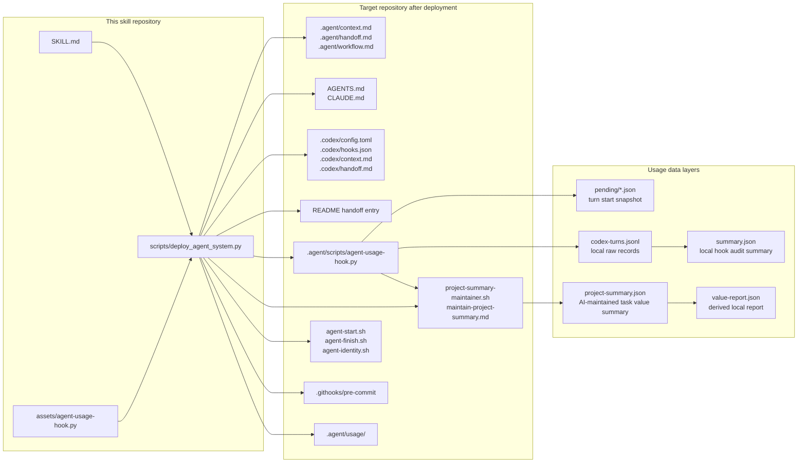
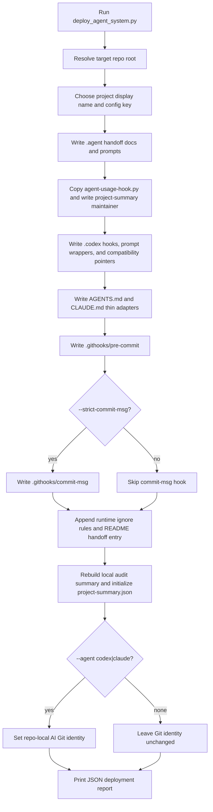
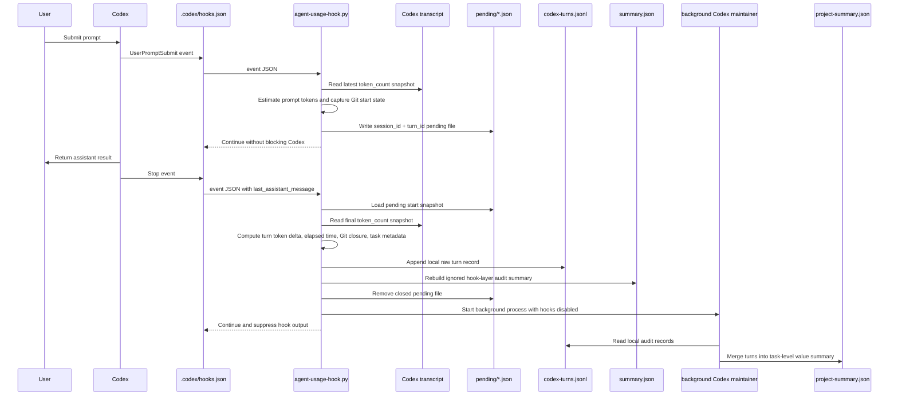
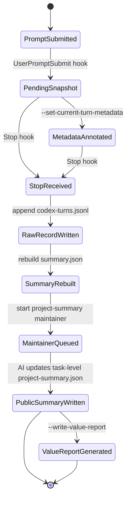
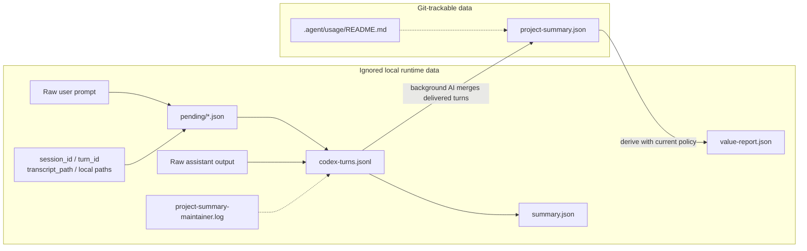
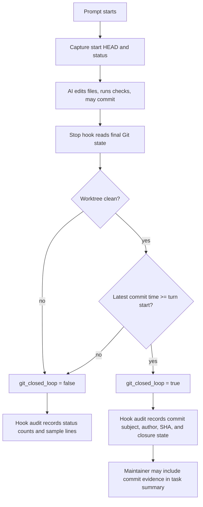

# Agent Handoff Metrics Bootstrap Design

[Back to README](../README.md) | [中文设计文档](design_zh.md)

This document covers the detailed architecture behind Agent Handoff Metrics Bootstrap: project memory, handoff workflow, runtime collection, data privacy boundaries, metrics modeling, and Git closure.

## Architecture

AI handoff metrics are not just token accounting. This system combines how AI coding agents hand off project context with how each AI-assisted turn becomes auditable project-level usage data.

- Handoff: keep the next AI coding agent aligned through `.agent/context.md`, `.agent/handoff.md`, `.agent/workflow.md`, thin `AGENTS.md` / `CLAUDE.md` adapters, and Codex compatibility pointers back to `.agent/*`.
- Metrics: capture each AI-assisted turn as local hook-layer audit data, then let a background Codex maintainer update a commit-safe task-level value summary. Cost and ROI are derived later without committing raw prompts or local machine details.

The architecture has six planes:

- Project handoff plane: durable context, current handoff, workflow rules, and start/finish prompts.
- Runtime event plane: Codex `UserPromptSubmit` and `Stop` hooks.
- Collection plane: `.agent/scripts/agent-usage-hook.py`, token transcript reader, Git snapshot reader, and local task metadata writer.
- Maintainer plane: `.agent/scripts/project-summary-maintainer.sh` runs Codex after Stop to maintain `project-summary.json`.
- Storage plane: local raw records, local audit summary, and commit-safe task-level public summary.
- Reporting plane: derived value report using the current task summary, pricing, and labor assumptions.

## Deployment Flow

The deployer is conservative: existing generated files are skipped by default, and `--force` creates backups before overwriting.

## Runtime Collection Flow

Codex hooks call the same script twice per turn. The first call records a start snapshot; the second call closes the turn, computes deltas, appends a raw local audit record, rebuilds the ignored local audit summary, and queues the background project-summary maintainer.

## Turn State Machine

Each turn moves through a small lifecycle. A turn can still be recorded if transcript token data is incomplete; in that case the script falls back from cumulative transcript deltas to the latest model-call usage, then to zeroed usage fields.

## Data And Privacy Flow

The public summary is intentionally task-level rather than turn-level. Hook files keep the local audit trail; the background maintainer decides which turns become value-bearing tasks and which turns remain only in local metadata.

## Metrics Model

The hook-layer audit summary answers runtime questions and stays local:

- recorded turns, token totals, elapsed time, models, and Git status per turn.
- local prompt/output estimates and machine-specific evidence.

The project summary answers task-value questions and is safe to track:

- `tasks[]`: task-level summaries maintained by background Codex.
- `included_turn_indexes`: the audit-record order numbers included in each task, without session IDs or turn IDs.
- `token_usage` and `elapsed_seconds`: aggregate values for the included turns.
- `business_value`: AI-maintained description, complexity, and rationale.
- `totals`: audit turn counts, included turn counts, excluded turn counts, and task counts.

Consultation, pure Git bookkeeping, hook smoke tests, and no-deliverable turns may be omitted from `tasks[]` and remain only in the hook audit files.

Derived value reports add policy-dependent numbers:

- AI cost from task-level model and token totals.
- Traditional engineering cost from configured complexity-to-hours assumptions.
- Replacement savings and ROI.
- Per-model cost and value totals.

Because prices, exchange rates, and labor assumptions can change, `value-report.json` is regenerated locally and ignored by default.

## Git Closure Flow

Git closure connects hook metadata to actual repository outcomes. The hook records the starting `HEAD` and status at prompt time, then checks the final `HEAD`, status, and latest commit at stop time. The background maintainer may roll those hints into task-level Git evidence when a turn contributed to a value-bearing task.

