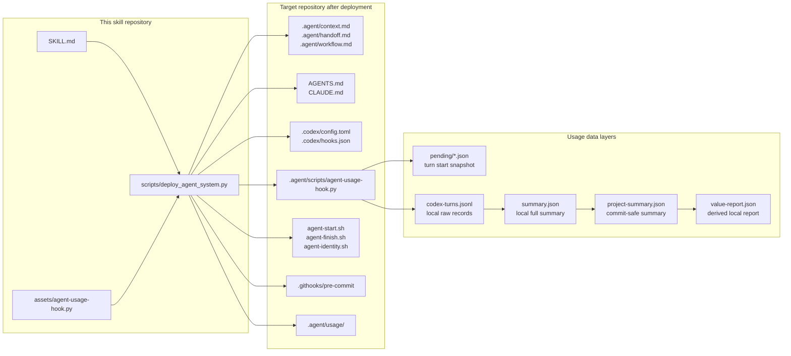
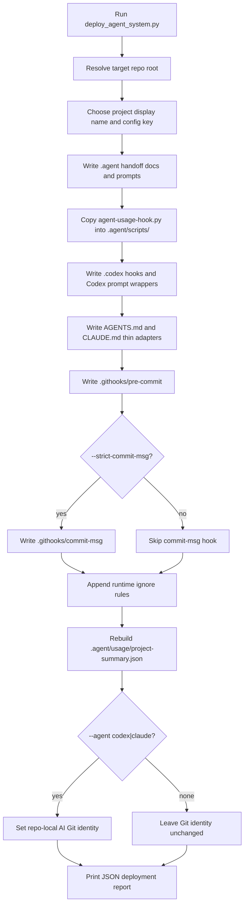
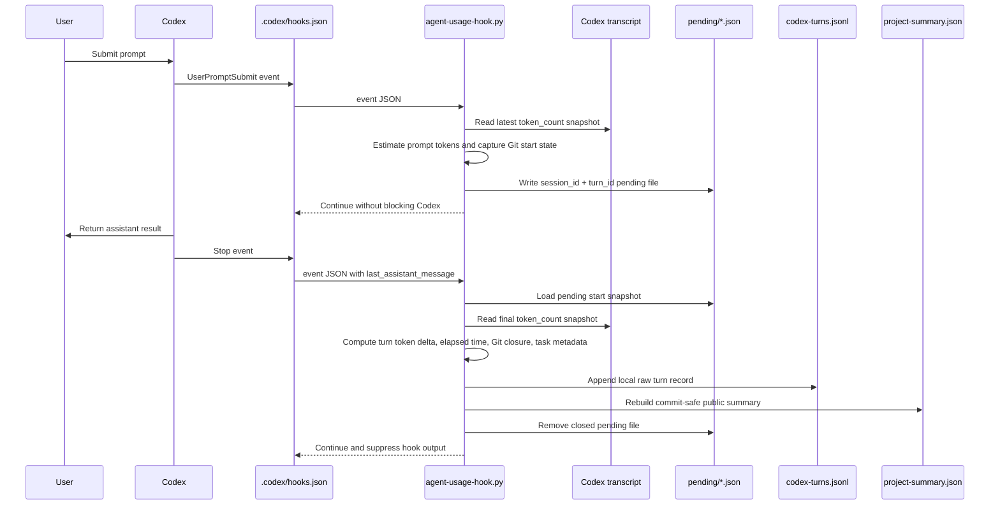
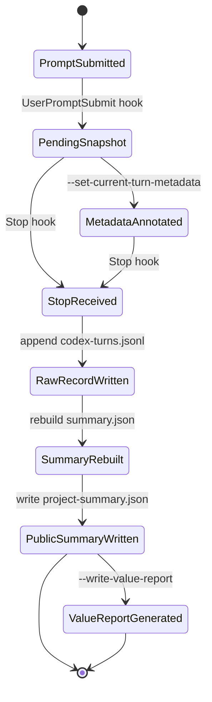
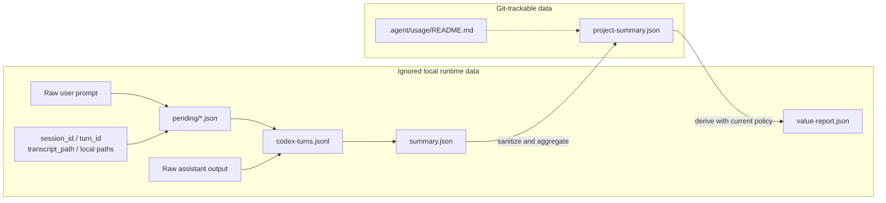
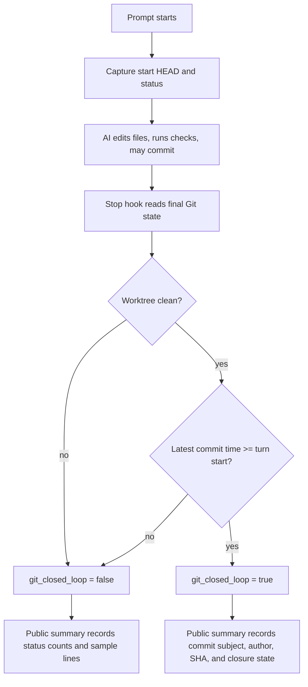

# Agent Handoff Metrics Bootstrap Design

[Back to README](../README.md) | [中文设计文档](design_zh.md)

This document covers the detailed architecture behind Agent Handoff Metrics Bootstrap: project memory, handoff workflow, runtime collection, data privacy boundaries, metrics modeling, and Git closure.

## Architecture

AI handoff metrics are not just token accounting. This system combines how AI coding agents hand off project context with how each AI-assisted turn becomes auditable project-level usage data.

- Handoff: keep the next AI coding agent aligned through `.agent/context.md`, `.agent/handoff.md`, `.agent/workflow.md`, and thin `AGENTS.md` / `CLAUDE.md` adapters.
- Metrics: capture each AI-assisted turn, summarize safe project-level usage, and derive local cost/value reports without committing raw prompts or local machine details.

The architecture has five planes:

- Project handoff plane: durable context, current handoff, workflow rules, and start/finish prompts.
- Runtime event plane: Codex `UserPromptSubmit` and `Stop` hooks.
- Collection plane: `.agent/scripts/agent-usage-hook.py`, token transcript reader, Git snapshot reader, and task metadata writer.
- Storage plane: local raw records, local full summary, and commit-safe public summary.
- Reporting plane: derived value report using current pricing and labor assumptions.

## Deployment Flow

The deployer is conservative: existing generated files are skipped by default, and `--force` creates backups before overwriting.

## Runtime Collection Flow

Codex hooks call the same script twice per turn. The first call records a start snapshot; the second call closes the turn, computes deltas, appends a raw record, and rebuilds summaries.

## Turn State Machine

Each turn moves through a small lifecycle. A turn can still be recorded if transcript token data is incomplete; in that case the script falls back from cumulative transcript deltas to the latest model-call usage, then to zeroed usage fields.

## Data And Privacy Flow

The public summary is intentionally smaller than the local records. This lets teams track AI handoff and usage in Git without exposing prompts, assistant output, transcript paths, or local session identifiers.

## Metrics Model

The project summary is meant to answer operational questions without leaking sensitive content:

- `recorded_turns`: number of closed Codex turns recorded for the project.
- `assisted_tasks_estimate`: count of turns with assistant output.
- `git_closed_loops`: turns where the worktree was clean and a commit happened after the prompt started.
- `token_totals`: input, cached input, uncached input, output, reasoning output, and total token totals.
- `elapsed_seconds_total`: total recorded wall-clock time across turns.
- `complexity_counts`: AI-assessed task complexity distribution.
- `turns_by_model`: recorded turns grouped by model.
- `task_history`: sanitized AI task summaries, complexity, timing, token usage, and Git closure state.

Derived value reports add policy-dependent numbers:

- AI cost from model pricing and token totals.
- Traditional engineering cost from configured complexity-to-hours assumptions.
- Replacement savings and ROI.
- Per-model cost and value totals.

Because prices, exchange rates, and labor assumptions can change, `value-report.json` is regenerated locally and ignored by default.

## Git Closure Flow

Git closure connects usage metrics to actual repository outcomes. The hook records the starting `HEAD` and status at prompt time, then checks the final `HEAD`, status, and latest commit at stop time.

