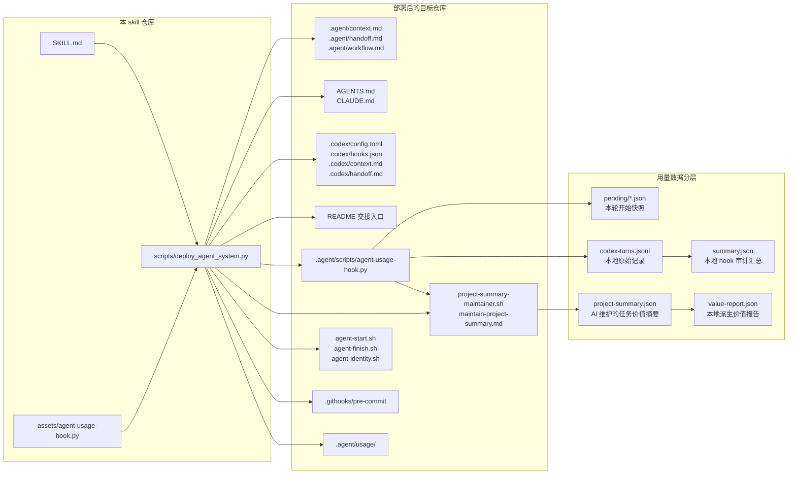
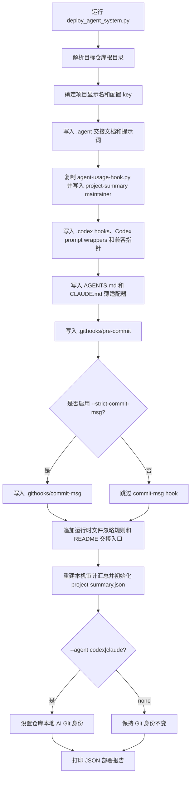
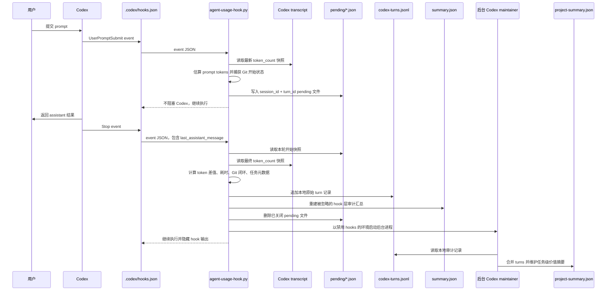
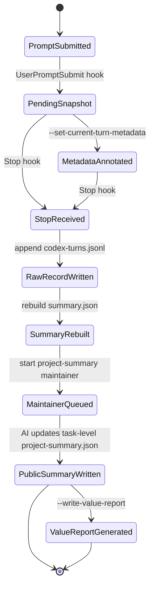
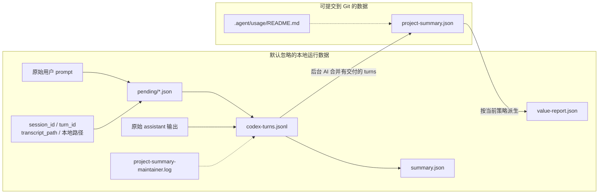
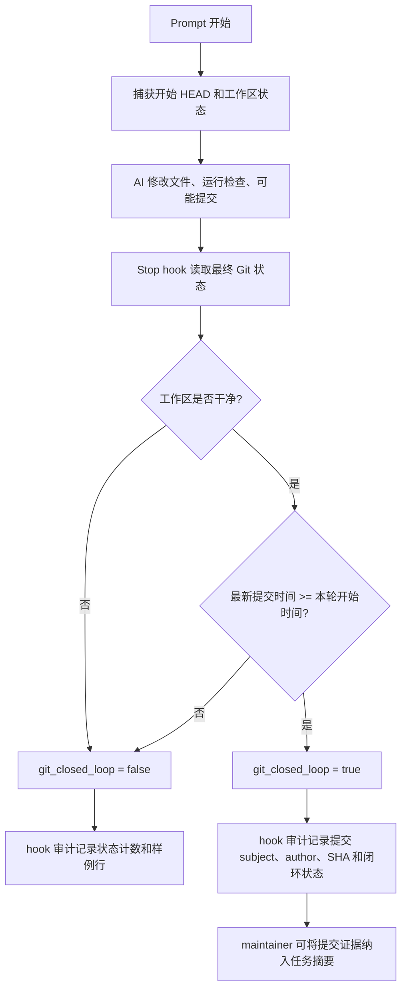

# Agent Handoff Metrics Bootstrap 设计文档

[返回 README](../README_zh.md) | [English design](design.md)

本文档说明 Agent Handoff Metrics Bootstrap 的详细设计：项目记忆、交接工作流、运行时采集、数据隐私边界、度量模型和 Git 闭环。

## AI 接管与度量架构

这里的 AI 接管与度量不是单纯记录 token，而是把“AI 如何接管项目”和“每轮 AI 工作如何形成可审计度量”放在同一套工程结构里。

- Handoff：通过 `.agent/context.md`、`.agent/handoff.md`、`.agent/workflow.md`、轻量 `AGENTS.md` / `CLAUDE.md` 入口，以及指回 `.agent/*` 的 Codex 兼容指针，让下一个 AI coding agent 能稳定接手。
- Metrics：把每轮 AI 辅助工作记录为本机 hook 层审计数据，再由后台 Codex maintainer 更新可提交的任务级价值摘要；成本和 ROI 后续派生，同时避免提交原始 prompt 或本机运行细节。

整体架构分为六层：

- Project handoff plane：项目上下文、当前交接、工作规则、启动/收尾提示。
- Runtime event plane：Codex `UserPromptSubmit` 和 `Stop` hooks。
- Collection plane：`.agent/scripts/agent-usage-hook.py`、token transcript 读取、Git 快照读取、本机任务元数据写入。
- Maintainer plane：`.agent/scripts/project-summary-maintainer.sh` 在 Stop 后运行 Codex 维护 `project-summary.json`。
- Storage plane：本地原始记录、本地审计汇总、可提交任务级公开摘要。
- Reporting plane：基于当前任务摘要、价格、汇率和人工工时假设派生价值报告。

## 部署流程

部署脚本是保守的：默认跳过已经存在的文件；传入 `--force` 时，会先备份再覆盖。

## 运行时采集流程

Codex hooks 每轮会调用同一个脚本两次。第一次记录开始快照；第二次关闭本轮记录，计算用量差值、追加本机原始审计记录、重建被忽略的本机审计汇总，并排队启动后台 project-summary maintainer。

## 单轮状态机

每一轮 AI 工作会经过一个小型生命周期。如果 transcript token 数据不完整，脚本仍然会记录本轮；它会先尝试使用累计 token 差值，再退回到最新一次模型调用用量，最后才使用零值字段。

## 数据和隐私边界

公开摘要刻意是任务级，而不是逐轮流水。hook 文件保留本机审计轨迹；后台 maintainer 判断哪些 turns 形成有价值任务，哪些 turns 只留在本地元数据中。

## 度量模型

hook 层审计汇总回答运行时问题，并保留在本机：

- 已记录 turns、token 汇总、耗时、模型、每轮 Git 状态。
- 本地 prompt/output 估算和机器相关证据。

`project-summary.json` 回答任务价值问题，并适合纳入 Git：

- `tasks[]`：后台 Codex 维护的任务级摘要。
- `included_turn_indexes`：每个任务包含的审计记录序号，不包含 session ID 或 turn ID。
- `token_usage` 和 `elapsed_seconds`：纳入 turns 的聚合值。
- `business_value`：AI 维护的价值说明、复杂度和依据。
- `totals`：审计 turn 数、纳入 turn 数、排除 turn 数和任务数。

咨询、纯 Git 流程、hook smoke、无交付结果等 turns 可以不进入 `tasks[]`，只保留在 hook 审计文件中。

派生价值报告会增加依赖策略的指标：

- 基于任务级模型和 token 用量估算 AI 成本。
- 基于复杂度到工时的配置估算传统人工成本。
- 替代节约额和 ROI。
- 按模型分组的成本和价值汇总。

由于价格、汇率和人工工时假设可能变化，`value-report.json` 默认在本地重新生成并被忽略，不提交。

## Git 闭环流程

Git 闭环把 hook 元数据和真实仓库结果连接起来。hook 会在 prompt 开始时记录起始 `HEAD` 和状态，在 stop 时检查最终 `HEAD`、工作区状态和最新提交。后台 maintainer 可以在某个 turn 形成有价值任务时，把这些提示归入任务级 Git 证据。

