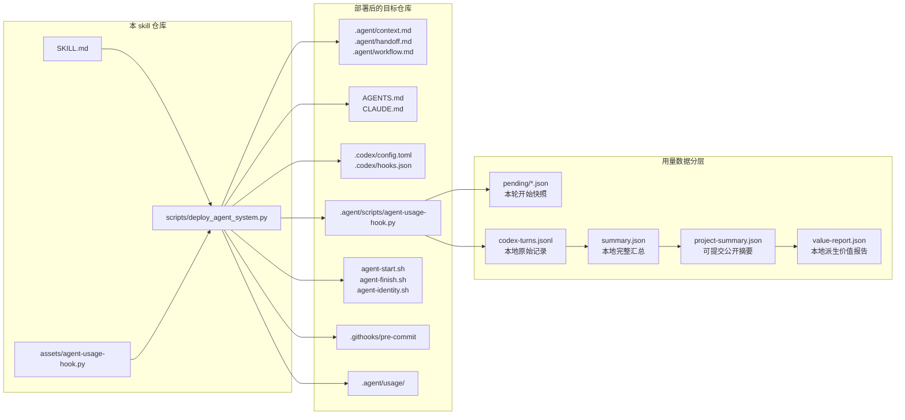
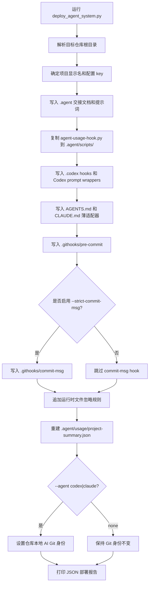
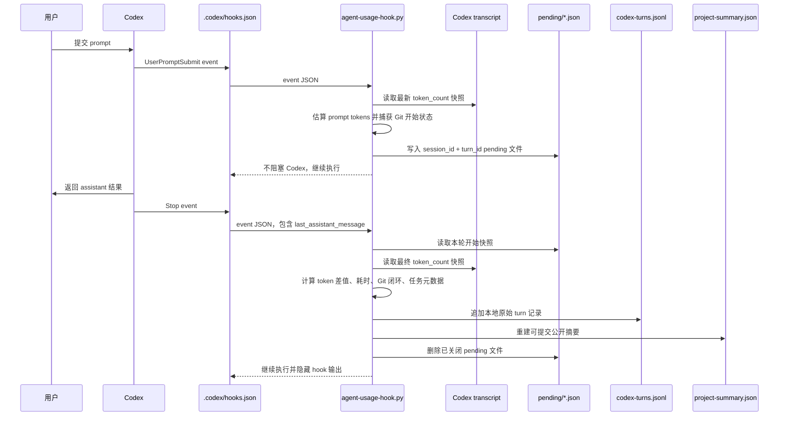
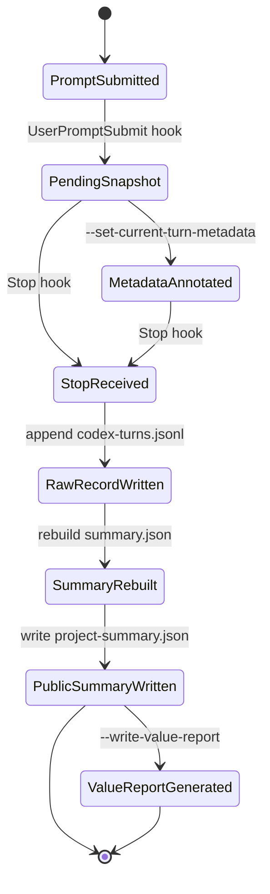
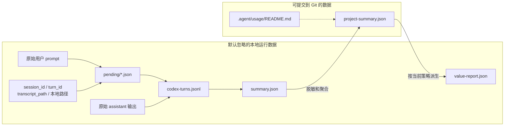
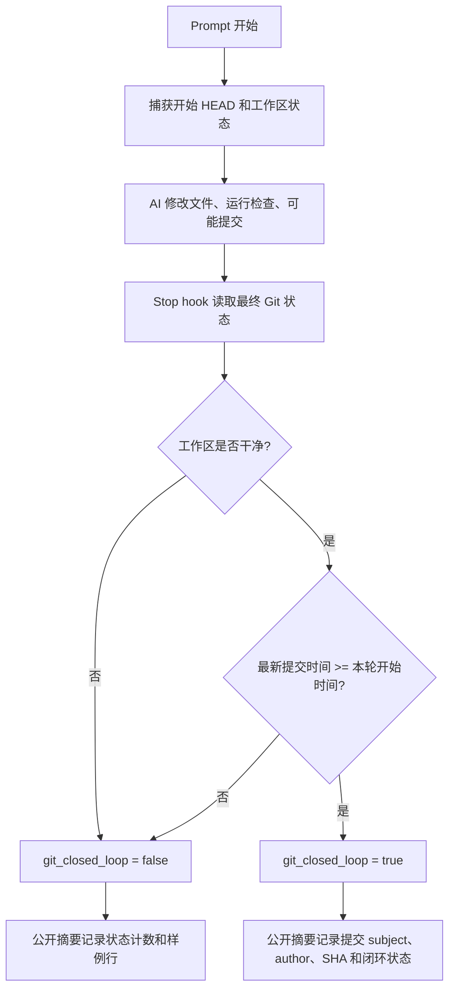

# Agent Handoff Metrics Bootstrap 设计文档

[返回 README](../README_zh.md) | [English design](design.md)

本文档说明 Agent Handoff Metrics Bootstrap 的详细设计：项目记忆、交接工作流、运行时采集、数据隐私边界、度量模型和 Git 闭环。

## AI 接管与度量架构

这里的 AI 接管与度量不是单纯记录 token，而是把“AI 如何接管项目”和“每轮 AI 工作如何形成可审计度量”放在同一套工程结构里。

- Handoff：通过 `.agent/context.md`、`.agent/handoff.md`、`.agent/workflow.md` 和轻量 `AGENTS.md` / `CLAUDE.md` 入口，让下一个 AI coding agent 能稳定接手。
- Metrics：捕获每轮 AI 辅助工作，生成可提交的项目级用量摘要，并在本地派生成本和价值报告，同时避免提交原始 prompt 或本机运行细节。

整体架构分为五层：

- Project handoff plane：项目上下文、当前交接、工作规则、启动/收尾提示。
- Runtime event plane：Codex `UserPromptSubmit` 和 `Stop` hooks。
- Collection plane：`.agent/scripts/agent-usage-hook.py`、token transcript 读取、Git 快照读取、任务元数据写入。
- Storage plane：本地原始记录、本地完整汇总、可提交公开摘要。
- Reporting plane：基于当前价格、汇率和人工工时假设派生价值报告。

## 部署流程

部署脚本是保守的：默认跳过已经存在的文件；传入 `--force` 时，会先备份再覆盖。

## 运行时采集流程

Codex hooks 每轮会调用同一个脚本两次。第一次记录开始快照；第二次关闭本轮记录，计算用量差值、追加原始记录并重建摘要。

## 单轮状态机

每一轮 AI 工作会经过一个小型生命周期。如果 transcript token 数据不完整，脚本仍然会记录本轮；它会先尝试使用累计 token 差值，再退回到最新一次模型调用用量，最后才使用零值字段。

## 数据和隐私边界

公开摘要刻意比本地记录更小。这样团队可以把 AI 接管和使用量指标纳入 Git 跟踪，同时避免暴露 prompt、assistant 输出、transcript 路径或本地 session 标识。

## 度量模型

`project-summary.json` 用来回答工程管理问题，同时不泄漏敏感内容：

- `recorded_turns`：已关闭并记录的 Codex turns 数量。
- `assisted_tasks_estimate`：有 assistant 输出的 turns 数量。
- `git_closed_loops`：本轮开始后产生了提交，且结束时工作区干净的 turns 数量。
- `token_totals`：input、cached input、uncached input、output、reasoning output、total token 汇总。
- `elapsed_seconds_total`：所有记录轮次的墙钟耗时总和。
- `complexity_counts`：AI 评估的任务复杂度分布。
- `turns_by_model`：按模型分组的记录轮次数。
- `task_history`：脱敏后的 AI 任务摘要、复杂度、耗时、token 用量和 Git 闭环状态。

派生价值报告会增加依赖策略的指标：

- 基于模型价格和 token 用量估算 AI 成本。
- 基于复杂度到工时的配置估算传统人工成本。
- 替代节约额和 ROI。
- 按模型分组的成本和价值汇总。

由于价格、汇率和人工工时假设可能变化，`value-report.json` 默认在本地重新生成并被忽略，不提交。

## Git 闭环流程

Git 闭环把 AI 用量指标和真实仓库结果连接起来。hook 会在 prompt 开始时记录起始 `HEAD` 和状态，在 stop 时检查最终 `HEAD`、工作区状态和最新提交。

